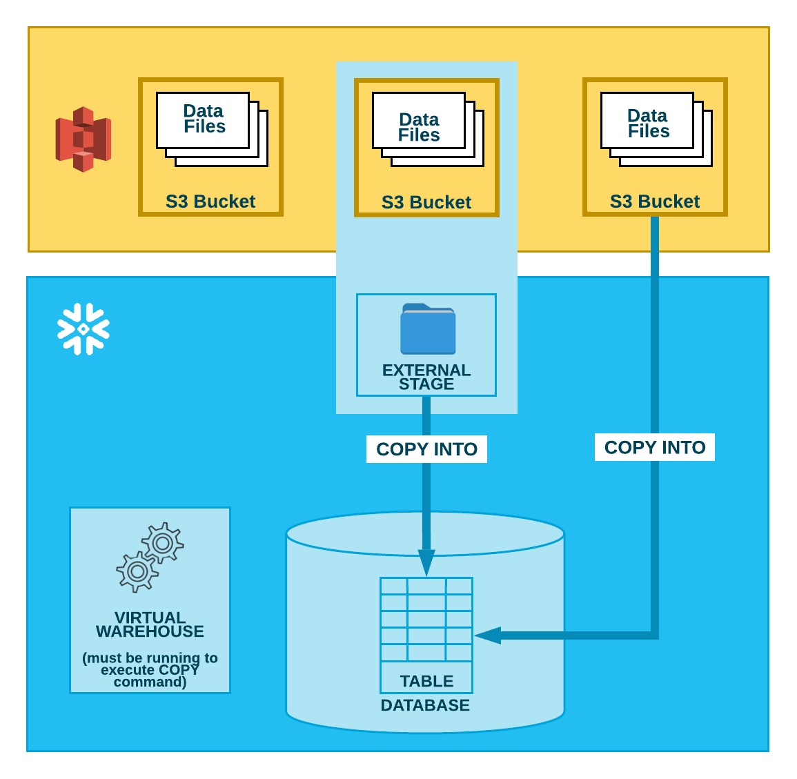

## Bulk loading from Amazon S3

As illustrated in the diagram below, loading data from an S3 bucket is performed in two steps:

1. Snowflake assumes the data files have already been staged in an S3 bucket. If they haven’t been staged yet, use the upload interfaces/utilities provided by AWS to stage the files.

2. Use the `COPY INTO <table>` command to load the contents of the staged file(s) into a Snowflake database table. You can load directly from the bucket, but Snowflake recommends creating an external stage that references the bucket and using the external stage instead.

Regardless of the method you use, this step requires a running, current virtual warehouse for the session if you execute the command manually or within a script. The warehouse provides the compute resources to perform the actual insertion of rows into the table.

